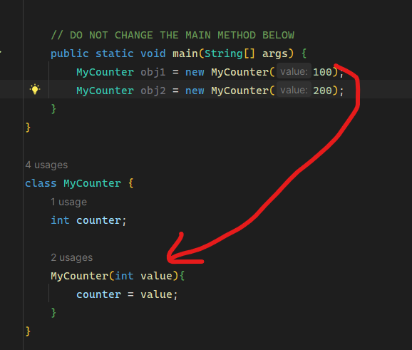

# 생성자

자바는 외부에서 값을 전달 받아 초기화 할 수 있다(자동차 객체라 하면 자동차마다 색상을 다르게 초기화 한다던지). 바로 생성자(constructor)이다. 생성자는 객체가 생성될 때 객체를 초기화 하는 특수한 메소드이다.

생서자의 이름은 클래스 이름과 같다. 일반 메소드와 비슷하지만 return값을 가지지 않는다. 생성자 이름 앞에는 아무것도 붙이지 않는다. 생성자는 주로 필드에 초기값을 부여할 때 많이 사용되지만 특별한 초기화 절차를 수행할 수도 있다.

생성자는 객체가 생성될 때 new에 의하여 호출된다.

### 매개변수를 가지는 생성자

외부에서 전달되는 값이 매개 변수에 저장된다.



### new 연산자와 생성자

```java
참조변수 = new 클래스이름(인수);
```

여기서 `참조변수`는 생성되는 객체를 가리키는 변수이다. `클래스이름`은 현재 생성되는 클래스 이름으로 뒤에 ()가 붙으면 생성자가 된다. 생성자는 매개 변수를 가질 수 있다. 만약 클래스가 생성자를 가지지 않는다면 자바에 의하여 제공되는 기본 생성자를 사용한다. 따라서 어떤 클래스든지 생성자가 호출된다. new 연산자는 새로 생성된 객체를 가리키는 참조값을 반환한다. 이 참조값이 `참조변수`에 저장된다.

자바에서 모든 클래스는 생성자를 가진다. 자바는 자동적으로 멤버변수들을 기본값으로 초기화하는 기본 생성자(default constructor)를 가진다. 기본 생성자에서는 필드가 int와 같은 수치형 변수라면 0으로, 참조형 변수라면 null로, 부울형 변수라면 false로 초기화 한다.