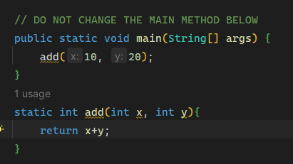

# static

## 정적 멤버

자바에서는 객체를 통하지 않고 사용할 수 있는 멤버를 생성하는 것이 가능하다. 이들 멤버는 모든 객체를 통틀어서 하나만 생성되고 모든 객체가 이것을 공유하게 된다. 이러한 멤버를 정적 멤버(static member) 또는 클래스 멤버(class member)라고 한다. 멤버를 정의할 때 앞에 static을 붙이면 정적 멤버가 된다.

### 인스턴스 멤버 vs 정적 멤버

동일한 클래스를 이용하여 객체들이 생성될 때 각각의 객체(인스턴스)들은 자신만의 변수를 가진다. 이들 변수는 **인스턴스마다 별도로 생성**되기 때문에 인스턴스 변수라고도 한다. 각 객체는 변수에 대하여 별도의 기억 공간을 갖고 있으며 각기 다른 값을 가지고 있다.

경웨 따라서 모든 객체의 공통인 변수가 필요하기도 한데 이것이 정적 변수(class variable)이다. 정적 변수는 하나의 클래스에 하나만 존재한다. 정적 변수는 객체보다는 클래스와 연결되어 있다. 클래스 변수라고도 한다. 모든 객체들은 하나의 정적 변수를 공유한다. 정적 변수를 만드려면 변수를 정의할 때 앞에 static을 붙이면 된다. 정적 변수는 인스턴스를 생성하지 않아도 사용이 가능하다. 

외부에서 정적 멤버를 사용하려면 단순히 클래스 이름 뒤에 멤버 연산자(.)를 붙이면 된다. 객체를 생성할 필요가 없다. `Television.**count** = 10000` 

### 정적 메소드

메소드도 정적 메소드로 만들 수 있다. 정적 메소드는 static 수식자를 메소드 앞에 붙이며 클래스 이름을 통하여 호출되어야 한다.

```java
클래스이름.메소드이름(인수1, 인수2, ... )
```

main() 메소드 앞에도 static이 붙어 있다. 자바 가상 기계가 객체를 생성할 필요가 없이 main 메소드를 호출할 수 있도록 하기 위해서다.

### 정적 멤버 사용시 주의할 점

- 객체가 생성되지 않은 상태에서 호출되는 메소드이므로 객체 안에서만 존재하는 인스턴스 변수들은 사용할 수 없다. 정적 변수와 지역 변수만을 사용할 수 있다.
- 정적 메소드에서 인스턴스 메소드를 호출하면 역시 오류가 된다. 인스턴스 메소드도 객체가 생성되어야만 사용할 수 있기 때문이다.
    
    

    

    
- 정적 메소드에서 정적 메소드를 호출하는 것은 가능하다. 정적 메소드는 this 키워드를 사용할 수 없다. 왜냐하면 this가 참조할 인스턴스가 없기 때문이다.

### 상수

상수를 정의할 때 static과 final 수식어를 동시에 사용하는 경우가 많다. 클래스 변수는 모든 객체가 공유하는 정보를 나타내는 데 사용되는데, 대표적인 것이 상수이다. 상수를 인스턴스 변수로 선언하면 각 객체마다 하나씩 만들어지므로 저장 공간이 낭비된다. 따라서 상수는 static을 정의하여 클래스 변수로 정의하는 것이 바람직하다.